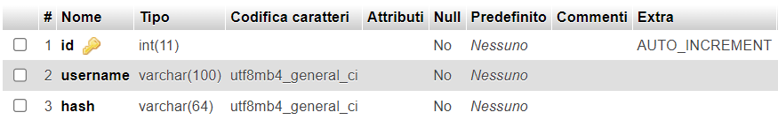

# JavaDrive
Simple drive using java

# Documentazione

## Come usare:

1. La classe `Packet` deve essere comune a client e server.
2. Avere un server MySQL attivo all'indirizzo impostato in `database.url` (vedi `server/config.properties`).
3. Un database esistente chiamato di default **"utenti"**.

### Struttura del database:

- **`<nome_id>`**: `INT` (univoco/primary key) con `AUTO_INCREMENT`  
  _Id identificatore_
- **`username`**: `VARCHAR(<lunghezza nome massima>)`  
  _Nome non univoco_
- **`hash`**: `VARCHAR(64)`  
  _Password dopo SHA256 + salt_

#### Esempio:

---

## Codici stato client:

| Codice | Significato | Note |
|--------|-------------|------|
| 0      | Il server è pronto a trasmettere | Ricevuto solo all'inizio dello scambio dei messaggi |
| 1      | Il client è stato disconnesso per troppi tentativi | |
| 2      | Il client ha fatto il login | |
| 3      | Il client ha registrato un nuovo utente | |
| 4      | Il client ha provato a fare il login ma la combinazione username/password è sbagliata | |
| 5      | Il server non può più accettare connessioni | Causa: congestione |
| 6      | Il server sta chiudendo | |
| 7      | Il client sta aspettando i nomi dei file precedentemente caricati | |
| 8      | Il server sta aspettando i dati del file | |
| 99     | Conferma file ricevuto | Inviato da entrambi per confermare la ricezione del file e indicare il prossimo |

### **Classe Packet**

La classe `Packet` contiene principalmente:

- **Due stringhe**:
  - `USER`: Contiene il nome utente inserito dal cliente per il login.
  - `PASS`: La stringa contenente la password dopo l'hash

- **Una pila di stringhe**:
  - Contiene i nomi dei file che il server utilizzerà per salvare i file ricevuti.

- **Un booleano**:
  - Indica se il cliente sta registrando un nuovo utente (se vero) o facendo il login come utente esistente.

Inoltre, la classe `Packet` include un metodo statico per l'hashing SHA256 e il salt utilizzato.

### **Classe Auth**
La classe `Auth` viene utilizzata per interfacciarsi con il database.

**Metodi:**

- **`addUser(String user, String Hashed_Pwd): boolean`**  
  Controlla l'esistenza dell'utente `user`: se esiste, restituisce `false`, altrimenti aggiunge un nuovo record alla tabella degli utenti e restituisce `true`.

- **`login(String user, String Hashed_Pwd): boolean`**  
  Controlla l'esistenza dell'utente `user`: se esiste, restituisce `false`, altrimenti compara la password contenuta nel database con quella ricevuta. Se sono uguali, restituisce `true`, altrimenti `false`.

- **`isAlive(): boolean`**  
  Restituisce `true` se il server MySQL è attivo e funzionante.

### **Config Server**

| **Parametro**| **Descrizione**| **Valore Predefinito**|
|-|-|-|
| `connection.max`| Numero massimo di connessioni simultanee che il server può gestire.                                               | 3|
| `server.port`| Porta su cui il server è in ascolto per le connessioni in ingresso.| 6969|
| `server.dir`| Cartella in cui vengono salvati i file caricati, includendo la cartella per ogni utente (es. `server.dir/Utente1`). | `uploads\\`|
| `server.attempts`| Numero massimo di tentativi di login che il server accetta prima di bloccare l'accesso.| 3|
| `database.url`| URL del database MySQL, comprensivo del nome del database (es. `mysql://localhost:3306/utenti`).| `mysql://localhost:3306/utenti`       |
| `database.username`| Username per l'accesso al database MySQL.                                                                         | `root`|
| `database.password`| Password per l'accesso al database MySQL.                                                                         | (Vuoto)                               |
